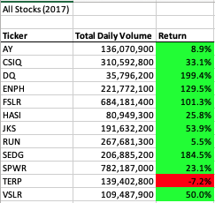
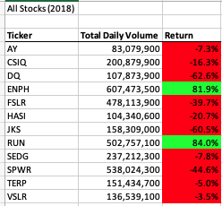
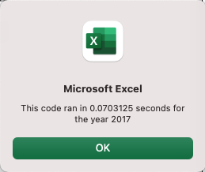
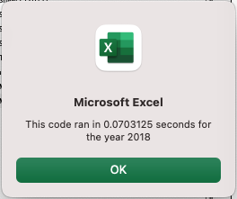

# Wall Street ( VBA )

## Overview of Project

### Purpose:

The purpose of this project was to refactor the Microsoft Excel VBA code to collect information on specific stocks in 2017 and 2018 and determine if the stocks are worth investing in. This process was originally done in a similar fashion, but the purpose of this round was to make the original code more efficient.
     
____
## Analysis:

As a result of our analysis, we can conclude that ENPH and RUN are good stocks to invest in, as they rose 81.9% and 84% respectively in 2018, while DQ fell 62% in 2018. Under depreciation from 2018.  

### Analysis Based on 2017 Retures

### Analysis Based on 2018 Retures

___
## Summary:

### The Advantages of Refactoring Code

The advantages of refactoring the giving code are that you can clean it up and organize it better, and even find bugs from your reader's perspective that the author didn't notice. A new look can improve and optimize your code. In this case, we were able to save 0.8 seconds by refactoring the code.

___

### Pros and Cons of Refactoring VBA Script Code:

Refactoring helps make your code cleaner and more organized. Benefits of cleaner code include improved design and software, debugging, and faster programming. It's also more concise and direct, so it's easier to read, so other people looking at your project will also benefit. However, there are downsides, so you can't always afford to refactor your code. These shortcomings range from oversized applications to lack of test cases for existing code. Any attempt to refactor your code can end up being risky.

